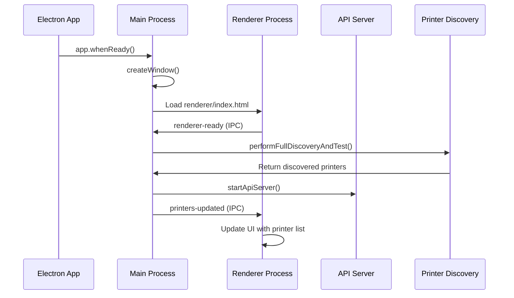
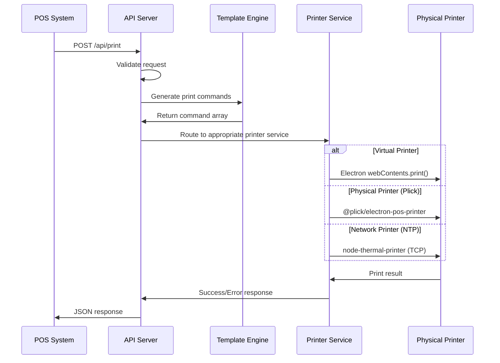

# POS Print Bridge (Electron)

A comprehensive Electron-based printing bridge application that enables POS
(Point of Sale) systems to communicate with various types of printers including
thermal printers, network printers, and virtual printers.

## 🏗️ Architecture Overview

This application follows a multi-process Electron architecture with clear
separation of concerns:

```
┌─────────────────────────────────────────────────────────────────┐
│                    ELECTRON MAIN PROCESS                        │
│  ┌─────────────────┐  ┌─────────────────┐  ┌─────────────────┐ │
│  │  Printer        │  │   API Server    │  │  Window         │ │
│  │  Discovery      │  │   (Express)     │  │  Management     │ │
│  │  & Testing      │  │                 │  │                 │ │
│  └─────────────────┘  └─────────────────┘  └─────────────────┘ │
└─────────────────────────────────────────────────────────────────┘
                                │
                                │ IPC Communication
                                │
┌─────────────────────────────────────────────────────────────────┐
│                   ELECTRON RENDERER PROCESS                     │
│  ┌─────────────────┐  ┌─────────────────┐  ┌─────────────────┐ │
│  │     UI          │  │   Status        │  │   Printer       │ │
│  │  Management     │  │   Display       │  │   List View     │ │
│  │                 │  │                 │  │                 │ │
│  └─────────────────┘  └─────────────────┘  └─────────────────┘ │
└─────────────────────────────────────────────────────────────────┘
                                │
                                │ HTTP API Calls
                                │
┌─────────────────────────────────────────────────────────────────┐
│                    EXTERNAL POS SYSTEMS                         │
│  ┌─────────────────┐  ┌─────────────────┐  ┌─────────────────┐ │
│  │   React POS     │  │   Web Apps      │  │   Other Apps    │ │
│  │   Application   │  │                 │  │                 │ │
│  └─────────────────┘  └─────────────────┘  └─────────────────┘ │
└─────────────────────────────────────────────────────────────────┘
```

## 📊 Data Flow Architecture

### 1. Application Initialization Flow



### 2. Printer Discovery Flow

The application discovers printers through multiple methods:

#### OS Printer Discovery (Electron Native)

```javascript
// Uses Electron's webContents.getPrintersAsync()
webContents.getPrintersAsync() → OS Printers List
```

#### Network Printer Discovery (mDNS/Bonjour)

```javascript
// Scans for network services
bonjourService.find({type: 'ipp'}) → Network Printers
bonjourService.find({type: 'pdl-datastream'}) → Raw TCP Printers
```

#### Printer Classification Logic

```
Discovered Printer → Classification Engine → Printer Types:
├── VIRTUAL (PDF, XPS, OneNote)
├── OS_PLICK (OS-installed physical printers)
├── MDNS_LAN (Network-discovered printers)
└── RAW_USB (Direct USB connection)
```

### 3. Print Job Processing Flow



## 🔧 Core Components

### Main Process (`src/electron-main.js`)

**Responsibilities:**

- Window lifecycle management
- Printer discovery coordination
- API server initialization
- IPC communication handling

**Key Functions:**

- `performFullDiscoveryAndTest()`: Orchestrates printer discovery
- `createWindow()`: Creates and manages the main application window
- `updateRendererStatus()`: Sends status updates to UI

### Printer Discovery (`src/print-discovery.js`)

**Responsibilities:**

- OS printer enumeration via Electron
- Network printer discovery via mDNS/Bonjour
- Printer connection testing
- Printer classification and status management

**Discovery Methods:**

1. **OS Discovery**: Uses `webContents.getPrintersAsync()`
2. **Network Discovery**: Scans for IPP, PDL-datastream, and other print
   services
3. **Connection Testing**: Validates printer connectivity using appropriate
   protocols

### API Server (`src/api/server.js`)

**Responsibilities:**

- RESTful API endpoint management
- Request routing and validation
- Print job processing coordination

**Endpoints:**

- `GET /api/printers`: List all discovered printers
- `POST /api/print`: Process print jobs with templates
- `POST /api/print-pdf`: Handle PDF printing
- `GET /api/health`: Health check endpoint

### Template System (`src/templates/`)

**Responsibilities:**

- Convert business data into print commands
- Support multiple receipt/ticket formats
- Generate printer-specific command sequences

**Template Types:**

- Kitchen Order Tickets (KOT)
- Sales Receipts
- Invoice Formats
- Custom Templates

### Print Services

**Multiple printing pathways:**

1. **Virtual Printing**: Uses Electron's native print API
2. **Plick EPP**: Uses `@plick/electron-pos-printer` for OS-registered printers
3. **Thermal Printing**: Uses `node-thermal-printer` for direct network/USB
   communication

## 🖨️ Printer Types & Connection Methods

### Virtual Printers

- **Examples**: PDF writers, XPS Document Writer, OneNote
- **Method**: Electron `webContents.print()`
- **Use Case**: Document generation, testing

### OS-Registered Physical Printers (OS_PLICK)

- **Examples**: Installed thermal printers, network printers with drivers
- **Method**: `@plick/electron-pos-printer`
- **Advantages**: Uses OS print spooler, supports all OS printer features

### Network Printers (MDNS_LAN)

- **Examples**: Ethernet/WiFi thermal printers, IPP printers
- **Discovery**: mDNS/Bonjour service discovery
- **Method**: Direct TCP/IP communication or OS drivers

### USB Printers (RAW_USB)

- **Examples**: Direct USB thermal printers
- **Method**: Direct USB communication (future implementation)

## 🔄 Process Communication

### IPC (Inter-Process Communication)

```javascript
// Main → Renderer
mainWindow.webContents.send("printers-updated", printers);
mainWindow.webContents.send("printer-status-update", message);

// Renderer → Main
ipcRenderer.send("renderer-ready");
ipcRenderer.invoke("rediscover-printers");
```

### API Communication

```javascript
// External → API Server
POST /api/print
{
  "printerName": "Thermal Printer",
  "templateType": "KOT_SAVE",
  "templateData": { /* order data */ }
}
```

## 📁 Project Structure

```
├── src/
│   ├── electron-main.js          # Main Electron process
│   ├── print-discovery.js        # Printer discovery logic
│   ├── bridge-api.js            # Legacy API implementation
│   ├── api/
│   │   ├── server.js            # Express server setup
│   │   └── routes/              # API route handlers
│   ├── config/
│   │   └── index.js             # Configuration constants
│   ├── templates/               # Print template generators
│   ├── services/                # Business logic services
│   ├── formatters/              # Data formatting utilities
│   ├── pdf-generator/           # PDF generation services
│   └── utils/                   # Utility functions
├── renderer/
│   ├── index.html               # Main UI
│   ├── render.js                # UI logic and IPC handling
│   └── style.css                # Application styling
├── preload.js                   # Preload script for secure IPC
├── package.json                 # Dependencies and scripts
└── assets/                      # Static assets
```

## 🚀 Getting Started

### Prerequisites

- Node.js (v16 or higher)
- Python (for native module compilation)
- Windows/macOS/Linux

### Installation

```bash
# Install dependencies
npm install

# Development mode
npm run dev

# Production build
npm run dist
```

### Environment Variables

```bash
API_PORT=3030  # API server port (default: 3030)
```

## 🔌 API Usage

### Get Available Printers

```bash
curl http://localhost:3030/api/printers
```

### Send Print Job

```bash
curl -X POST http://localhost:3030/api/print \
  -H "Content-Type: application/json" \
  -d '{
    "printerName": "Thermal Printer",
    "templateType": "KOT_SAVE",
    "templateData": {
      "orderNumber": "12345",
      "items": [
        {"name": "Coffee", "quantity": 2, "price": 5.00}
      ]
    }
  }'
```

## 🔧 Configuration

### Printer Options

```javascript
{
  "silent": true,           // Print without dialog
  "copies": 1,             // Number of copies
  "pageSize": "80mm",      // Paper size
  "margins": "0 0 0 0"     // Print margins
}
```

## 🔧 Template Configuration

Templates are modular JavaScript functions that transform business data (e.g., an order object) into a structured array of command objects. This array describes the content and layout of the receipt, which is then processed by the `@plick/electron-pos-printer` service. For a complete list of supported commands and advanced options, refer to the official [**`@plick/electron-pos-printer` documentation**](https://www.npmjs.com/package/@plick/electron-pos-printer).

This system provides a high-level, declarative way to build complex receipts using components like text, tables, and dividers, with support for CSS-like styling.

### Command Object Structure

The template function must return an array of command objects. The primary types are:

-   **`text`**: Prints a line of text.
    -   `value`: The string to print.
    -   `style`: An object with CSS-like properties (`fontWeight`, `fontSize`, `textAlign`, `fontFamily`, etc.).
-   **`table`**: Renders structured data in columns. Excellent for itemized lists.
    -   `tableHeader`: An array of strings or objects for the header row.
    -   `tableBody`: A 2D array representing the rows and cells.
    -   `style`: Global styles for the table.
    -   `tableHeaderStyle`, `tableBodyStyle`: Specific styles for header and body.
-   **`divider`**: Prints a horizontal separator line.

### Example Template: Kitchen Ticket

Below is a comprehensive example of a template function, `generateTwKitchenTakeawayTicket`, which generates a kitchen order ticket. It demonstrates dynamic content, helper functions, and advanced table generation for nested item lists.

```javascript
/**
 * Enhanced Kitchen Order Ticket Generator for Plick Electron Thermal Printer
 * Optimized for thermal printing with improved structure and performance
 *
 * @param {Object} data - The order data
 * @param {string} [data.storeName] - Store name
 * @param {string} [data.orderType] - Order type (TAKEAWAY, DINE-IN, etc.)
 * @param {string} [data.customerName] - Customer name
 * @param {string} [data.customerMobile] - Customer mobile number
 * @param {string} [data.deliveryTime] - Delivery time
 * @param {string} [data.orderNumber] - Order number
 * @param {string} [data.orderDate] - Order date
 * @param {string} [data.orderTime] - Order time
 * @param {number} [data.pax] - Number of people
 * @param {string} [data.followUpStatus] - Follow up status
 * @param {Array} [data.items] - Order items array
 * @param {string} [data.servedBy] - Server name
 * @param {string} [data.notes] - Order notes
 * @param {string} [data.fontFamily] - Font family for printing
 * @returns {Array} Array of print command objects
 */
export function generateTwKitchenTakeawayTicket(data = {}) {
	// Configuration constants
	const CONFIG = {
		paperCharWidth: 42,
		defaultFont: "Tahoma, Arial, sans-serif",
		separator: "---------------------------------------------",
		indentSize: 4,
	};

	/**
	 * Safe value extraction with defaults
	 */
	const safeValue = (value, defaultValue = "") => {
		return value !== undefined && value !== null
			? String(value).trim()
			: defaultValue;
	};

	/**
	 * Format date for thermal printer
	 */
	const formatDate = (date) => {
		if (!date) {
			return new Date()
				.toLocaleDateString("en-GB", {
					day: "2-digit",
					month: "short",
					year: "numeric",
				})
				.replace(/ /g, "-");
		}
		return safeValue(date);
	};

	/**
	 * Format time for thermal printer
	 */
	const formatTime = (time) => {
		if (!time) {
			return new Date().toLocaleTimeString("en-US", {
				hour: "numeric",
				minute: "2-digit",
				hour12: true,
			});
		}
		return safeValue(time);
	};

	/**
	 * Create a text command object
	 */
	const createTextCommand = (value, style = {}) => {
		return {
			type: "text",
			value: safeValue(value),
			style: {
				fontFamily: CONFIG.defaultFont,
				...style,
			},
		};
	};

    /**
	 * Get the last N characters of a string
	 */
	const getLastNChars = (str, n) => {
		if (typeof str !== "string") return "";
		if (n <= 0) return "";
		return str.slice(-n);
	};

	/**
	 * Generate header section
	 */
	const generateHeader = (data) => {
		const commands = [];
		const fontFamily = safeValue(data.fontFamily, CONFIG.defaultFont);

		commands.push(
			createTextCommand(safeValue(data.storeName, "TW KITCHEN"), {
				fontFamily,
				fontWeight: "bold",
				fontSize: "14px",
				textAlign: "center",
			})
		);
		commands.push(
			createTextCommand(
				`*** ${safeValue(data.orderType, "TAKEAWAY").toUpperCase()} ***`,
				{
					fontFamily,
					fontWeight: "bold",
					textAlign: "center",
				}
			)
		);
		commands.push(
			createTextCommand(getLastNChars(data.orderNumber, 5), {
				fontFamily,
				fontWeight: "bold",
				fontSize: "16px",
				textAlign: "center",
			})
		);

		const customerInfo = [
			{ label: "Customer", value: data.customerName },
			{ label: "Invoice Type", value: data.orderType },
			{ label: "Mobile No", value: data.customerMobile },
			{ label: "Delivery Time", value: data.deliveryTime },
		];

		customerInfo.forEach(({ label, value }) => {
			if (value) {
				commands.push(
					createTextCommand(`${label} : ${safeValue(value)}`, { fontFamily })
				);
			}
		});

		return commands;
	};

	/**
	 * Generate order number section
	 */
	const generateOrderNumber = (data) => {
		const commands = [];
		const fontFamily = safeValue(data.fontFamily, CONFIG.defaultFont);

		commands.push({ type: "divider" });
		commands.push(
			createTextCommand(`No# : ${safeValue(data.orderNumber, "N/A")}`, {
				fontFamily,
				fontWeight: "bold",
				fontSize: "16px",
				textAlign: "center",
			})
		);
		commands.push({ type: "divider" });

		return commands;
	};

	/**
	 * Generate date/time and pax section
	 */
	const generateDateTime = (data) => {
		const commands = [];
		const fontFamily = safeValue(data.fontFamily, CONFIG.defaultFont);

		const orderDate = formatDate(data.orderDate);
		const orderTime = formatTime(data.orderTime);
		const paxInfo = data.pax ? `Pax : ${parseFloat(safeValue(data.pax, 0)).toFixed(0)}` : "";

		const leftCol = `Date : ${orderDate} ${orderTime}`;
		const rightCol = paxInfo;
		const spaceCount = Math.max(1, CONFIG.paperCharWidth - leftCol.length - rightCol.length);

		commands.push(
			createTextCommand(`${leftCol}${" ".repeat(spaceCount)}${rightCol}`, { fontFamily })
		);

		if (data.followUpStatus && safeValue(data.followUpStatus).trim()) {
			commands.push(
				createTextCommand(safeValue(data.followUpStatus), {
					fontFamily,
					fontWeight: "bold",
					textAlign: "center",
				})
			);
		}

		return commands;
	};

	/**
	 * Build table rows recursively for nested items
	 */
	const buildTableRows = (item, indentLevel = 0, subItem = false) => {
		const rows = [];
		const isCategory = item.isCategory || (!item.hasOwnProperty("qty") && item.name);

		if (isCategory) {
			rows.push([
				{
					type: "text",
					value: safeValue(item.name).toUpperCase(),
					style: { fontWeight: subItem ? "light" : "bold", paddingTop: "4px", textAlign: "left" },
					colspan: 2,
				},
			]);
		} else {
			const indent = " ".repeat(indentLevel * CONFIG.indentSize);
			const namePrefix = indentLevel > 0 ? `${indent}- ` : indent;

			rows.push([
				{ type: "text", value: safeValue(item.qty, "0"), style: { fontWeight: "bold", fontSize: "14px", textAlign: "left" }},
				{ type: "text", value: `${namePrefix}${safeValue(item.name)}`, style: { fontWeight: "bold", fontSize: "14px", textAlign: "left" }},
			]);

			if (item.notes && safeValue(item.notes).trim()) {
				rows.push([
					{ type: "text", value: "", style: { textAlign: "left" }},
					{ type: "text", value: `${indent}(${safeValue(item.notes)})`, style: { fontSize: "12px", fontStyle: "italic", textAlign: "left" }},
				]);
			}
		}

		if (item.subItems && Array.isArray(item.subItems) && item.subItems.length > 0) {
			item.subItems.forEach((subItem) => {
				rows.push(...buildTableRows(subItem, indentLevel + 1, true));
			});
		}

		return rows;
	};

	/**
	 * Generate items table
	 */
	const generateItemsTable = (data) => {
		if (!data.items || !Array.isArray(data.items) || data.items.length === 0) return [];
		
		const fontFamily = safeValue(data.fontFamily, CONFIG.defaultFont);
		const tableBody = data.items.flatMap(item => buildTableRows(item));

		if (tableBody.length === 0) return [];

		return [{
			type: "table",
			style: { fontFamily, fontSize: "12px" },
			tableHeader: [
				{ type: "text", value: "Qty", style: { textAlign: "left", fontWeight: "bold" }},
				{ type: "text", value: "Menu", style: { textAlign: "left", fontWeight: "bold" }},
			],
			tableBody,
			tableFooter: [],
			tableHeaderStyle: { backgroundColor: "#ffffff", color: "#000000" },
			tableBodyStyle: {},
			tableFooterStyle: { backgroundColor: "#ffffff", color: "#000000" },
			tableHeaderCellStyle: { padding: "2px 2px", borderBottom: "1px solid #ccc" },
			tableBodyCellStyle: { padding: "4px 2px", borderBottom: "1px dash black" },
			tableFooterCellStyle: {},
		}];
	};

	/**
	 * Generate footer section
	 */
	const generateFooter = (data) => {
		const commands = [];
		const fontFamily = safeValue(data.fontFamily, CONFIG.defaultFont);

		if (data.servedBy && safeValue(data.servedBy).trim()) {
			commands.push(
				createTextCommand(`Served By : ${safeValue(data.servedBy)}`, {
					fontFamily,
					fontWeight: "bold",
					marginTop: "5px",
				})
			);
		}

		const notes = safeValue(data.notes).trim();
		if (notes) {
			commands.push({ type: "divider" });
			commands.push(createTextCommand("Notes :", { fontFamily, fontWeight: "bold" }));
			commands.push(
				createTextCommand(notes, {
					fontFamily,
					fontWeight: "bold",
					fontSize: "14px",
					width: "100%",
					wordWrap: "break-word",
					whiteSpace: "normal",
				})
			);
		}

		commands.push({ type: "divider", style: { marginBottom: "4px" } });
		return commands;
	};

	// Main function logic - Generate complete kitchen ticket
	try {
		const receipt = [
			...generateHeader(data),
			...generateOrderNumber(data),
			...generateDateTime(data),
			...generateItemsTable(data),
			...generateFooter(data),
		];
		return receipt;
	} catch (error) {
		console.error("Error generating kitchen ticket:", error);
		return [{ type: "text", value: "Error generating ticket", style: { textAlign: "center", color: "red" }}];
	}
}
```

## 📝 Development

### Adding New Templates

Adding a new receipt or ticket format is a straightforward process involving three steps:

**Step 1: Create the Template Function**

Create a new JavaScript file in the `src/templates/` directory (e.g., `my_new_receipt.js`). This file must export a function that accepts a `data` object as an argument and returns an array of Plick command objects, just like the `generateTwKitchenTakeawayTicket` example.

```javascript
// src/templates/my_new_receipt.js
export function generateMyNewReceipt(data) {
  return [
    { type: 'text', value: 'My New Receipt', style: { fontWeight: 'bold' } },
    { type: 'text', value: `Order ID: ${data.orderId}` },
    // ... more command objects
  ];
}
```

**Step 2: Import the New Template**

Open `src/templates/index.js`. This file acts as a central registry for all available templates. Add an `import` statement at the top to include your new template function.

```javascript
// src/templates/index.js
import { generateTwKitchenTakeawayTicket } from "./kot_save_recipt.js";
import { generateChelokababTakeawayReceipt } from "./template_2.js";
import { generateGoCrispyInvoiceReceipt } from "./inv_recipt2.js";
import { generateMyNewReceipt } from "./my_new_receipt.js"; // <-- Add this line
// ... other imports
```

**Step 3: Register the Template**

In the same file (`src/templates/index.js`), add a new entry to the `templateGenerators` object. The key is a unique string identifier (e.g., `MY_RECEIPT`) that you will use in your API calls. The value is the name of the function you just imported.

```javascript
// src/templates/index.js

// ... imports

export const templateGenerators = {
	KOT_SAVE: generateTwKitchenTakeawayTicket,
	DISPATCH: genarateDispatchRecipt,
	INV: generateGoCrispyInvoiceReceipt,
	MY_RECEIPT: generateMyNewReceipt, // <-- Add this line
	// ... other templates
};

export function getTemplateFunction(templateType) {
	const templateFunction = templateGenerators[templateType.toUpperCase()];
	if (!templateFunction) {
		throw new Error(`Template type '${templateType}' not found.`);
	}
	return templateFunction;
}
```

After these steps, the new template is ready to be used. You can now make a `POST /api/print` request with `"templateType": "MY_RECEIPT"` to print your new format.

### Adding New Printer Types

1. Implement discovery logic in `src/print-discovery.js`.
2. Add print handling in API routes.
3. Update printer classification logic.

## 🐛 Troubleshooting

### Common Issues

1. **Printer Not Found**

   - Ensure printer is installed in OS
   - Check network connectivity for network printers
   - Verify printer is powered on

2. **Print Job Fails**

   - Check printer status in OS
   - Verify template data format
   - Check API server logs

3. **API Server Won't Start**
   - Check if port is already in use
   - Verify firewall settings
   - Check Node.js permissions

### Debug Mode

Enable detailed logging by setting environment variables:

```bash
DEBUG=* npm run dev
```

## 📝 Development

### Adding New Templates

1. Create template function in `src/templates/`
2. Export function in `src/templates/index.js`
3. Register in template generators map

### Adding New Printer Types

1. Implement discovery logic in `src/print-discovery.js`
2. Add print handling in API routes
3. Update printer classification logic

## 🔒 Security Considerations

- API server binds to all interfaces (0.0.0.0) for network access
- No authentication implemented (suitable for internal networks)
- File system access limited to temp directories for virtual printing
- IPC communication secured through context isolation

## 📄 License

© 2024 Anvin Infosystem. All rights reserved.

## 🤝 Contributing

This is a proprietary application. For support or feature requests, contact the
development team.
