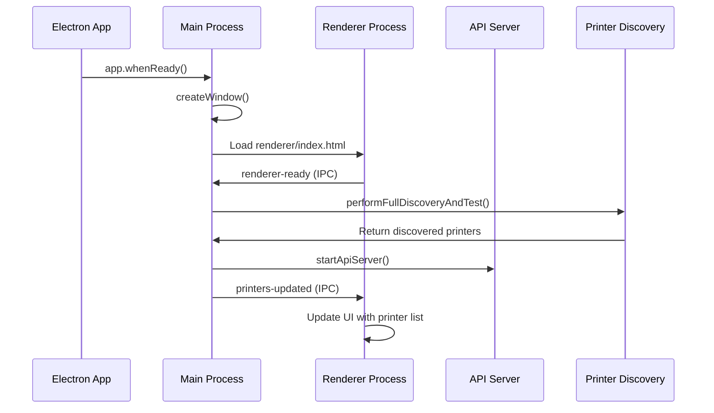
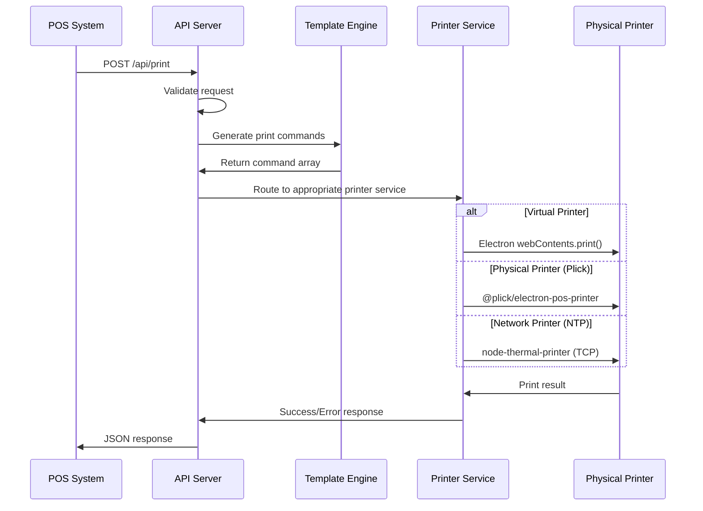

# POS Print Bridge (Electron)

A comprehensive Electron-based printing bridge application that enables POS
(Point of Sale) systems to communicate with various types of printers including
thermal printers, network printers, and virtual printers.

## 🏗️ Architecture Overview

This application follows a multi-process Electron architecture with clear
separation of concerns:

```
┌─────────────────────────────────────────────────────────────────┐
│                    ELECTRON MAIN PROCESS                        │
│  ┌─────────────────┐  ┌─────────────────┐  ┌─────────────────┐ │
│  │  Printer        │  │   API Server    │  │  Window         │ │
│  │  Discovery      │  │   (Express)     │  │  Management     │ │
│  │  & Testing      │  │                 │  │                 │ │
│  └─────────────────┘  └─────────────────┘  └─────────────────┘ │
└─────────────────────────────────────────────────────────────────┘
                                │
                                │ IPC Communication
                                │
┌─────────────────────────────────────────────────────────────────┐
│                   ELECTRON RENDERER PROCESS                     │
│  ┌─────────────────┐  ┌─────────────────┐  ┌─────────────────┐ │
│  │     UI          │  │   Status        │  │   Printer       │ │
│  │  Management     │  │   Display       │  │   List View     │ │
│  │                 │  │                 │  │                 │ │
│  └─────────────────┘  └─────────────────┘  └─────────────────┘ │
└─────────────────────────────────────────────────────────────────┘
                                │
                                │ HTTP API Calls
                                │
┌─────────────────────────────────────────────────────────────────┐
│                    EXTERNAL POS SYSTEMS                         │
│  ┌─────────────────┐  ┌─────────────────┐  ┌─────────────────┐ │
│  │   React POS     │  │   Web Apps      │  │   Other Apps    │ │
│  │   Application   │  │                 │  │                 │ │
│  └─────────────────┘  └─────────────────┘  └─────────────────┘ │
└─────────────────────────────────────────────────────────────────┘
```

## 📊 Data Flow Architecture

### 1. Application Initialization Flow



### 2. Printer Discovery Flow

The application discovers printers through multiple methods:

#### OS Printer Discovery (Electron Native)

```javascript
// Uses Electron's webContents.getPrintersAsync()
webContents.getPrintersAsync() → OS Printers List
```

#### Network Printer Discovery (mDNS/Bonjour)

```javascript
// Scans for network services
bonjourService.find({type: 'ipp'}) → Network Printers
bonjourService.find({type: 'pdl-datastream'}) → Raw TCP Printers
```

#### Printer Classification Logic

```
Discovered Printer → Classification Engine → Printer Types:
├── VIRTUAL (PDF, XPS, OneNote)
├── OS_PLICK (OS-installed physical printers)
├── MDNS_LAN (Network-discovered printers)
└── RAW_USB (Direct USB connection)
```

### 3. Print Job Processing Flow



## 🔧 Core Components

### Main Process (`src/electron-main.js`)

**Responsibilities:**

- Window lifecycle management
- Printer discovery coordination
- API server initialization
- IPC communication handling

**Key Functions:**

- `performFullDiscoveryAndTest()`: Orchestrates printer discovery
- `createWindow()`: Creates and manages the main application window
- `updateRendererStatus()`: Sends status updates to UI

### Printer Discovery (`src/print-discovery.js`)

**Responsibilities:**

- OS printer enumeration via Electron
- Network printer discovery via mDNS/Bonjour
- Printer connection testing
- Printer classification and status management

**Discovery Methods:**

1. **OS Discovery**: Uses `webContents.getPrintersAsync()`
2. **Network Discovery**: Scans for IPP, PDL-datastream, and other print
   services
3. **Connection Testing**: Validates printer connectivity using appropriate
   protocols

### API Server (`src/api/server.js`)

**Responsibilities:**

- RESTful API endpoint management
- Request routing and validation
- Print job processing coordination

**Endpoints:**

- `GET /api/printers`: List all discovered printers
- `POST /api/print`: Process print jobs with templates
- `POST /api/print-pdf`: Handle PDF printing
- `GET /api/health`: Health check endpoint

### Template System (`src/templates/`)

**Responsibilities:**

- Convert business data into print commands
- Support multiple receipt/ticket formats
- Generate printer-specific command sequences

**Template Types:**

- Kitchen Order Tickets (KOT)
- Sales Receipts
- Invoice Formats
- Custom Templates

### Print Services

**Multiple printing pathways:**

1. **Virtual Printing**: Uses Electron's native print API
2. **Plick EPP**: Uses `@plick/electron-pos-printer` for OS-registered printers
3. **Thermal Printing**: Uses `node-thermal-printer` for direct network/USB
   communication

## 🖨️ Printer Types & Connection Methods

### Virtual Printers

- **Examples**: PDF writers, XPS Document Writer, OneNote
- **Method**: Electron `webContents.print()`
- **Use Case**: Document generation, testing

### OS-Registered Physical Printers (OS_PLICK)

- **Examples**: Installed thermal printers, network printers with drivers
- **Method**: `@plick/electron-pos-printer`
- **Advantages**: Uses OS print spooler, supports all OS printer features

### Network Printers (MDNS_LAN)

- **Examples**: Ethernet/WiFi thermal printers, IPP printers
- **Discovery**: mDNS/Bonjour service discovery
- **Method**: Direct TCP/IP communication or OS drivers

### USB Printers (RAW_USB)

- **Examples**: Direct USB thermal printers
- **Method**: Direct USB communication (future implementation)

## 🔄 Process Communication

### IPC (Inter-Process Communication)

```javascript
// Main → Renderer
mainWindow.webContents.send("printers-updated", printers);
mainWindow.webContents.send("printer-status-update", message);

// Renderer → Main
ipcRenderer.send("renderer-ready");
ipcRenderer.invoke("rediscover-printers");
```

### API Communication

```javascript
// External → API Server
POST /api/print
{
  "printerName": "Thermal Printer",
  "templateType": "KOT_SAVE",
  "templateData": { /* order data */ }
}
```

## 📁 Project Structure

```
├── src/
│   ├── electron-main.js          # Main Electron process
│   ├── print-discovery.js        # Printer discovery logic
│   ├── bridge-api.js            # Legacy API implementation
│   ├── api/
│   │   ├── server.js            # Express server setup
│   │   └── routes/              # API route handlers
│   ├── config/
│   │   └── index.js             # Configuration constants
│   ├── templates/               # Print template generators
│   ├── services/                # Business logic services
│   ├── formatters/              # Data formatting utilities
│   ├── pdf-generator/           # PDF generation services
│   └── utils/                   # Utility functions
├── renderer/
│   ├── index.html               # Main UI
│   ├── render.js                # UI logic and IPC handling
│   └── style.css                # Application styling
├── preload.js                   # Preload script for secure IPC
├── package.json                 # Dependencies and scripts
└── assets/                      # Static assets
```

## 🚀 Getting Started

### Prerequisites

- Node.js (v16 or higher)
- Python (for native module compilation)
- Windows/macOS/Linux

### Installation

```bash
# Install dependencies
npm install

# Development mode
npm run dev

# Production build
npm run dist
```

### Environment Variables

```bash
API_PORT=3030  # API server port (default: 3030)
```

## 🔌 API Usage

### Get Available Printers

```bash
curl http://localhost:3030/api/printers
```

### Send Print Job

```bash
curl -X POST http://localhost:3030/api/print \
  -H "Content-Type: application/json" \
  -d '{
    "printerName": "Thermal Printer",
    "templateType": "KOT_SAVE",
    "templateData": {
      "orderNumber": "12345",
      "items": [
        {"name": "Coffee", "quantity": 2, "price": 5.00}
      ]
    }
  }'
```

## 🔧 Configuration

### Printer Options

```javascript
{
  "silent": true,           // Print without dialog
  "copies": 1,             // Number of copies
  "pageSize": "80mm",      // Paper size
  "margins": "0 0 0 0"     // Print margins
}
```

### Template Configuration

Templates are modular functions that transform business data into structured print command arrays compatible with the `@plick/electron-pos-printer` package. Each template returns an array of command objects that the Plick thermal printer engine processes sequentially.

#### Plick Thermal Printer Commands

The system uses `@plick/electron-pos-printer` which supports ESC/POS command structure for thermal printers:

**Text Commands:**
- `text`: Print text with optional styling
- `newLine`: Line feed control
- `cut`: Paper cutting (full or partial)
- `align`: Text alignment control

**Styling Commands:**
- `bold`: Bold text formatting
- `underline`: Underlined text
- `size`: Text size control (width, height)
- `invert`: Inverted text (white on black)

**Special Commands:**
- `image`: Image printing (bitmap conversion)
- `qrcode`: QR code generation
- `barcode`: Various barcode formats
- `table`: Tabular data with column alignment

#### Template Structure with Plick Commands

```javascript
import { PosPrinter } from '@plick/electron-pos-printer';

export function generateThermalKitchenTicket(data) {
  return [
    // Header with restaurant info
    { type: 'text', value: data.restaurantName, style: { fontType: 'A', fontsize: 2, align: 'CT' }},
    { type: 'bold', format: true },
    { type: 'text', value: 'KITCHEN ORDER TICKET', style: { align: 'CT' }},
    { type: 'bold', format: false },
    { type: 'newLine' },
    { type: 'text', value: '================================' },
    { type: 'newLine' },
    
    // Order details
    { type: 'bold', format: true },
    { type: 'text', value: `Order #: ${data.orderNumber}` },
    { type: 'bold', format: false },
    { type: 'newLine' },
    { type: 'text', value: `Table: ${data.tableNumber || 'Takeaway'}` },
    { type: 'newLine' },
    { type: 'text', value: `Server: ${data.serverName}` },
    { type: 'newLine' },
    { type: 'text', value: `Time: ${new Date().toLocaleTimeString()}` },
    { type: 'newLine' },
    { type: 'text', value: '--------------------------------' },
    { type: 'newLine' },
    
    // Items list with ESC/POS formatting
    ...data.items.flatMap(item => [
      { type: 'bold', format: true },
      { type: 'size', width: 1, height: 1 },
      { type: 'text', value: `${item.quantity}x ${item.name}` },
      { type: 'bold', format: false },
      { type: 'newLine' },
      
      // Item modifiers
      ...((item.modifiers || []).map(mod => [
        { type: 'text', value: `   + ${mod}`, style: { fontType: 'B' }},
        { type: 'newLine' }
      ]).flat()),
      
      // Special instructions
      ...(item.specialInstructions ? [
        { type: 'underline', format: true },
        { type: 'text', value: `   Note: ${item.specialInstructions}` },
        { type: 'underline', format: false },
        { type: 'newLine' }
      ] : [])
    ]),
    
    // Footer
    { type: 'newLine' },
    { type: 'text', value: '================================' },
    { type: 'newLine' },
    { type: 'newLine' },
    { type: 'cut', mode: 'PART' }
  ];
}

export function generateThermalCustomerReceipt(data) {
  const subtotal = data.items.reduce((sum, item) => sum + (item.price * item.quantity), 0);
  const tax = subtotal * (data.taxRate || 0.1);
  const total = subtotal + tax;
  
  return [
    // Business header with large text
    { type: 'size', width: 2, height: 2 },
    { type: 'bold', format: true },
    { type: 'text', value: data.businessName, style: { align: 'CT' }},
    { type: 'bold', format: false },
    { type: 'size', width: 1, height: 1 },
    { type: 'newLine' },
    { type: 'text', value: data.businessAddress, style: { align: 'CT' }},
    { type: 'newLine' },
    { type: 'text', value: data.businessPhone, style: { align: 'CT' }},
    { type: 'newLine' },
    { type: 'newLine' },
    
    // Receipt info table using Plick table format
    {
      type: 'table',
      tableHeader: ['Receipt Info', 'Details'],
      tableBody: [
        [`Receipt: ${data.receiptNumber}`, new Date().toLocaleDateString()],
        [`Cashier: ${data.cashierName}`, new Date().toLocaleTimeString()]
      ],
      tableHeaderAlign: 'CT',
      tableBodyAlign: 'LT'
    },
    
    { type: 'text', value: '================================' },
    { type: 'newLine' },
    
    // Items table with proper formatting
    {
      type: 'table',
      tableHeader: ['Item', 'Qty', 'Amount'],
      tableBody: data.items.map(item => [
        item.name.substring(0, 18), // Truncate long names
        item.quantity.toString(),
        `${(item.price * item.quantity).toFixed(2)}`
      ]),
      tableHeaderAlign: 'CT',
      tableBodyAlign: 'LT'
    },
    
    { type: 'text', value: '--------------------------------' },
    { type: 'newLine' },
    
    // Totals with right alignment
    { type: 'text', value: `Subtotal:${' '.repeat(15)}${subtotal.toFixed(2)}`, style: { align: 'RT' }},
    { type: 'newLine' },
    { type: 'text', value: `Tax:${' '.repeat(20)}${tax.toFixed(2)}`, style: { align: 'RT' }},
    { type: 'newLine' },
    { type: 'bold', format: true },
    { type: 'size', width: 1, height: 2 },
    { type: 'text', value: `TOTAL:${' '.repeat(16)}${total.toFixed(2)}`, style: { align: 'RT' }},
    { type: 'bold', format: false },
    { type: 'size', width: 1, height: 1 },
    { type: 'newLine' },
    { type: 'newLine' },
    
    // Payment info
    { type: 'text', value: `Payment: ${data.paymentMethod}` },
    { type: 'newLine' },
    { type: 'text', value: `Change: ${data.change?.toFixed(2) || '0.00'}` },
    { type: 'newLine' },
    { type: 'newLine' },
    
    // Footer messages
    { type: 'text', value: 'Thank you for your business!', style: { align: 'CT' }},
    { type: 'newLine' },
    { type: 'text', value: 'Please come again!', style: { align: 'CT' }},
    { type: 'newLine' },
    
    // QR code for digital receipt (if supported)
    ...(data.digitalReceiptUrl ? [
      { type: 'newLine' },
      { type: 'text', value: 'Scan for digital receipt:', style: { align: 'CT' }},
      { type: 'newLine' },
      {
        type: 'qrcode',
        value: data.digitalReceiptUrl,
        settings: {
          model: 2,
          errorCorrectionLevel: 'M',
          moduleSize: 4,
          margin: 2
        },
        style: { align: 'CT' }
      }
    ] : []),
    
    { type: 'newLine' },
    { type: 'newLine' },
    { type: 'newLine' },
    { type: 'cut', mode: 'FULL' }
  ];
}
```


    align: 'CT',          // Text alignment
    bold: true,           // Bold formatting
    underline: true,      // Underline formatting
    invert: false         // Inverted colors
  }
}
```

#### Advanced Plick Features

**Image Printing:**
```javascript
export function generateReceiptWithLogo(data) {
  return [
    // Print logo image
    {
      type: 'image',
      path: data.logoPath,
      position: 'center',
      width: 200,
      height: 100
    },
    
    // Barcode printing
    {
      type: 'barcode',
      value: data.receiptNumber,
      format: 'CODE128',
      position: 'below',
      width: 'LARGE',
      height: 50,
      includetext: true
    },
    
    { type: 'cut', mode: 'PART' }
  ];
}
```

**Conditional Formatting:**
```javascript
export function generateDynamicReceipt(data) {
  return [
    // Conditional bold for VIP customers
    ...(data.customerType === 'VIP' ? [
      { type: 'bold', format: true },
      { type: 'invert', format: true }
    ] : []),
    
    { type: 'text', value: `Customer: ${data.customerName}`, style: { align: 'CT' }},
    
    ...(data.customerType === 'VIP' ? [
      { type: 'bold', format: false },
      { type: 'invert', format: false }
    ] : []),
    
    { type: 'cut', mode: 'FULL' }
  ];
}
```

## 🐛 Troubleshooting

### Common Issues

1. **Printer Not Found**

   - Ensure printer is installed in OS
   - Check network connectivity for network printers
   - Verify printer is powered on

2. **Print Job Fails**

   - Check printer status in OS
   - Verify template data format
   - Check API server logs

3. **API Server Won't Start**
   - Check if port is already in use
   - Verify firewall settings
   - Check Node.js permissions

### Debug Mode

Enable detailed logging by setting environment variables:

```bash
DEBUG=* npm run dev
```

## 📝 Development

### Adding New Templates

1. Create template function in `src/templates/`
2. Export function in `src/templates/index.js`
3. Register in template generators map

### Adding New Printer Types

1. Implement discovery logic in `src/print-discovery.js`
2. Add print handling in API routes
3. Update printer classification logic

## 🔒 Security Considerations

- API server binds to all interfaces (0.0.0.0) for network access
- No authentication implemented (suitable for internal networks)
- File system access limited to temp directories for virtual printing
- IPC communication secured through context isolation

## 📄 License

© 2024 Anvin Infosystem. All rights reserved.

## 🤝 Contributing

This is a proprietary application. For support or feature requests, contact the
development team.
